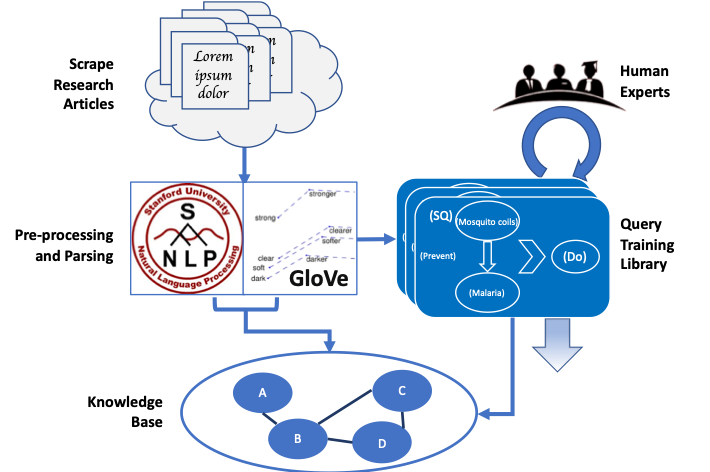
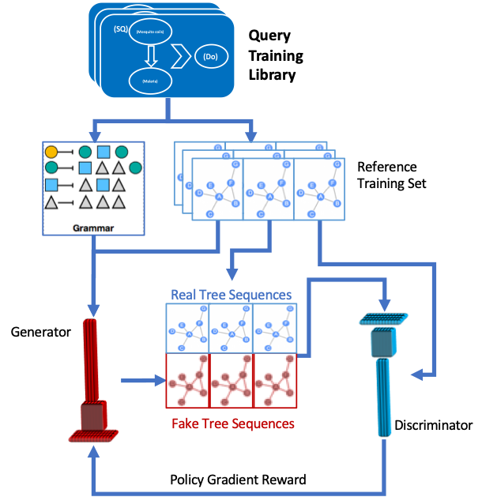

# MULTIVAC
DARPA’s Information Innovation Office’s Automating Scientific Knowledge Extraction (ASKE) program seeks to develop approaches to make it easier for scientists to build, maintain and reason over rich models of complex systems — which could include physical, biological, social, engineered or hybrid systems. By interpreting and exposing scientific knowledge and assumptions in existing model code and documentation, researchers can identify new data and information resources automatically, extracting useful information from these sources, and integrating this useful information into machine-curated expert models for robust modeling.

 Gallup’s Meta-model Unification Learned Through Inquiry Vectorization and Automated Comprehension (MULTIVAC) effort supports these goals by developing a system that absorbs scientific knowledge — in the form of facts, relationships, models and equations — from a particular domain corpus into a Markov Logic Network (MLN) ontology and learns to query that ontology in order to accelerate scientific exploration within the target domain. MULTIVAC will consist of an expert query generator trained on a corpus of historical expert queries and tuned dialectically with the use of a Generative Adversarial Network (GAN) architecture. As a prototype system, MULTIVAC will focus on the domain of epidemiological research, and specifically the realm of SIR/SEIR (Susceptible-Infected-Recovered, often with an additional “Exposed” element) compartmental model approaches. It is Gallup’s intent that this system includes a “human-in-the-loop” element, especially during training, to ensure that the system is properly tuned and responsive to the needs and interests of the human researchers it is intended to augment.

## System Setup and Operation
- <a href="https://github.com/GallupGovt/multivac/tree/master/doc/installation.md">MULTIVAC Installation</a>

## System Documentation
- <a href="https://github.com/GallupGovt/multivac/tree/master/doc#phase-i-development---system-overview">Phase I Development</a>
- <a href='https://github.com/GallupGovt/multivac/tree/master/doc/phase_two_development.md'>Phase II Developments</a>

## Conclusion
The MULTIVAC system is still in development along several lines of effort. Subsequent to that milestone the development process will expose MULTIVAC to expert epidemiological research community for evaluation and improvement. Additionally, Gallup will explore a variety of avenues for optimization and improvements in terms of computational efficiencies, semantic representational precision and accuracy, and usability. MULTIVAC’s prototype iterations will be largely command line driven, but a more fully formed version should include web and/or graphical interfaces to encourage a broader user community across domains.

For more information please contact Principal Investigator, Benjamin Ryan (ben_ryan@gallup.com).

---

## Acknowledgements
This work is supported by the Defense Advanced Research Projects Agency (DARPA) under Agreement No. HR00111990008.

